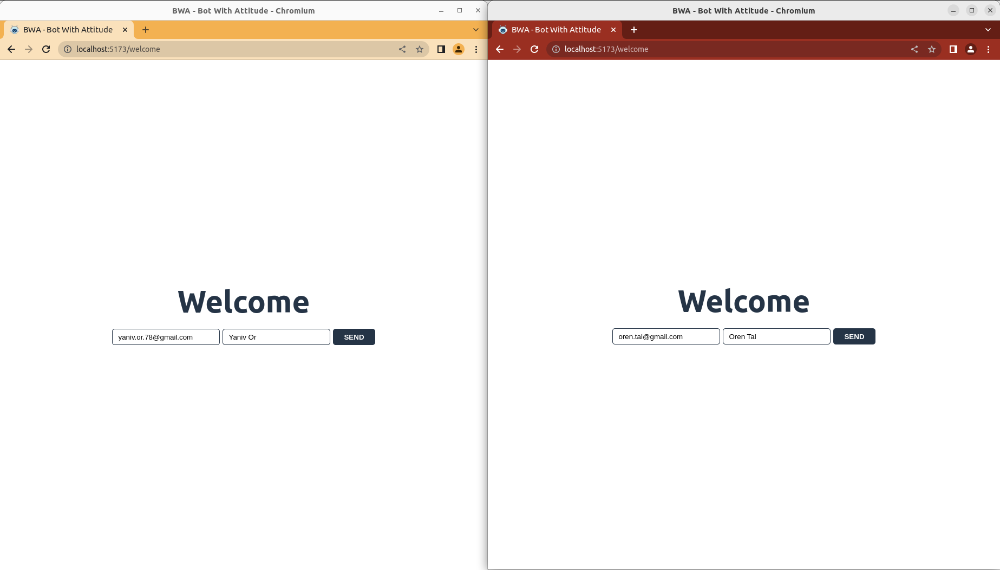
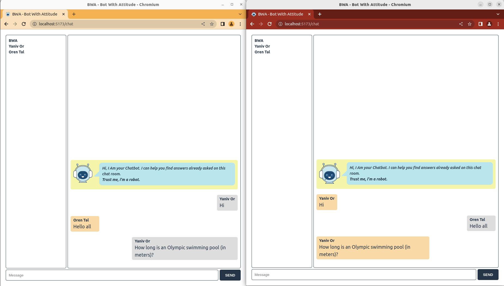
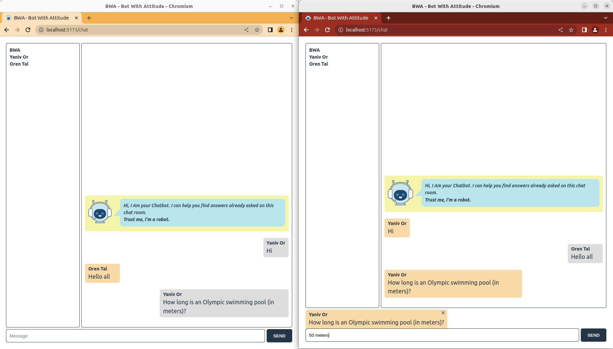
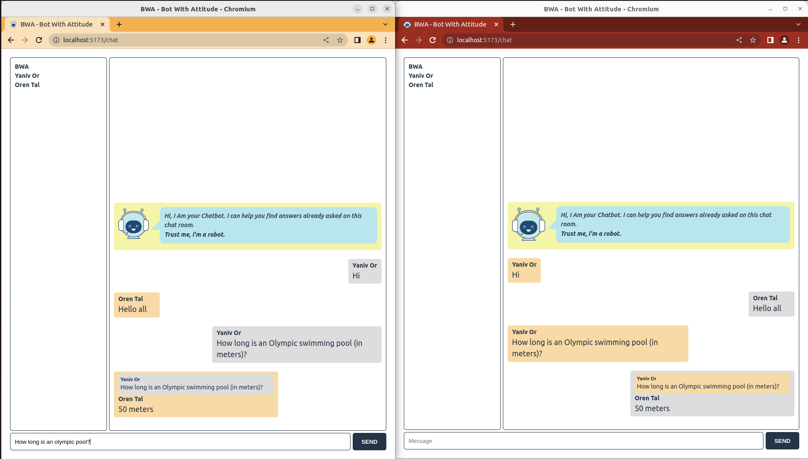

# BWA - bot-with-attitude

## elasticsearch

```
docker pull docker.elastic.co/elasticsearch/elasticsearch:8.6.2

docker network create elastic

docker run \
      --name elasticsearch \
      --net elastic \
      -p 9200:9200 \
      -e discovery.type=single-node \
      -e ES_JAVA_OPTS="-Xms1g -Xmx1g"\
      -e xpack.security.enabled=false \
      -d \
      docker.elastic.co/elasticsearch/elasticsearch:8.6.2
```

In case of cgroup issues (linux), run the following command and then docker run:

```
sudo mkdir /sys/fs/cgroup/systemd
sudo mount -t cgroup -o none,name=systemd cgroup /sys/fs/cgroup/systemd
```

Test with:

```
curl 127.0.0.1:9200
```

## backend

create .env file inside the backend folder

```
PORT_REST=8000
PORT_WS=3000
ES_ENDPOINT=http://127.0.0.1:9200
```

run the server

```
cd backend
npm i
npm run dev
```

## frontend

run the react application

```
cd frontend
npm i
npm run dev
```

## How to use the app?

You can test the app by opening two browser windows. The address is: http://localhost:5173
You'll see the login page. Enter the relevant details.



Now you can chat with the other members. Try asking the following question:

```
How long is an Olympic swimming pool (in meters)?
```



The other user can answer this question by clicking it. A box with this question will appear above the text field. Type:

```
50 meters
```

Click send and you'll see a box with both the question and the answer.



Now try to to ask the same question with some variations. For example:

```
How long is an olympic pool?
```



You'll see some nice animation and more information.

Thanks
